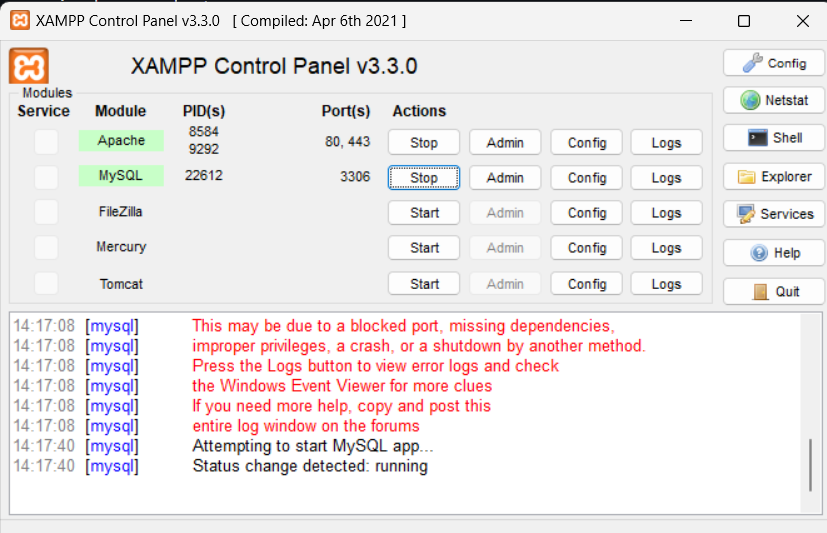
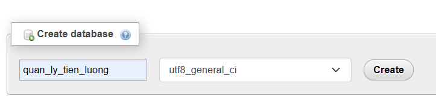

<a id="readme-top"></a>
<!-- PROJECT LOGO -->
<br />
<div align="center">


<h3 align="center">Quản lý nhân sự và tiền lương Phòng khám đa khoa Thiện Trang</h3>

  <p align="center">
    This's a group assignment in Open source develop course taught by Ms. Nguyen Thi Bich Hang
  </p>
</div>

<!-- TABLE OF CONTENTS -->
<details>
  <summary>Table of Contents</summary>
  <ol>
    <li>
      <a href="#about-the-project">About The Project</a>
      <ul>
        <li><a href="#built-with">Built With</a></li>
      </ul>
    </li>
    <li>
      <a href="#getting-started">Getting Started</a>
      <ul>
        <li><a href="#installation">Installation</a></li>
      </ul>
    </li>
    <li><a href="#license">License</a></li>
    <li><a href="#contact">Contact</a></li>
  </ol>
</details>


<!-- ABOUT THE PROJECT -->
## About The Project
<br>


After two months of learning about PHP our group has built this project. This is also our first project using PHP, so thanks for your care

<p align="right">(<a href="#readme-top">back to top</a>)</p>


### Built With


<p align="right">(<a href="#readme-top">back to top</a>)</p>

<!-- GETTING STARTED -->
## Getting Started

This is an example of how you may give instructions on setting up your project locally.
To get a local copy up and running follow these simple example steps.
### Installation
1. Download XAMPP, Composer
     * https://www.apachefriends.org/download.html
     * https://getcomposer.org/download/
2. Clone the repo in /xampp/htdocs
   ```sh
   git clone https://github.com/TonyHoe/QuanLyTienLuong_PHP.git
   ```
3. Start `Apache` and `MySQL` and Click Admin on line `MySQL`
   <br>
   
4. Create new database name `quan_ly_tien_luong` type `utf8_general_ci`
   <br>
   
5. Import file `database.sql` into your `quan_ly_tien_luong` database
   * [Database]('./database.sql)
6. Open new terminal from `QuanLyTienLuong_PHP` then install Composer packages
   ```sh
   composer --ignore-platform-reqs install
   ```
7. Access to `http://localhost/QuanLyTienLuong_PHP/`
8. All done !!!

<p align="right">(<a href="#readme-top">back to top</a>)</p>


<!-- LICENSE -->
## License
> Developed by Nhóm 1 Lớp 62.CNTT-3 Khoa Công nghệ Thông tin <br>
Trần Ngọc Tiến | Trương Khánh Hòa |	Nguyễn Duy Thiên | Phạm Ngọc Tuyển | Lê Hoàng Thiện


<p align="right">(<a href="#readme-top">back to top</a>)</p>


<!-- CONTACT -->
## Contact
- Updating...

<p align="right">(<a href="#readme-top">back to top</a>)</p>
